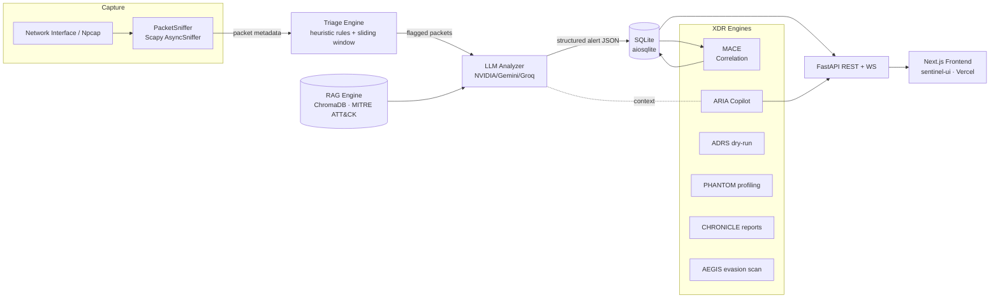
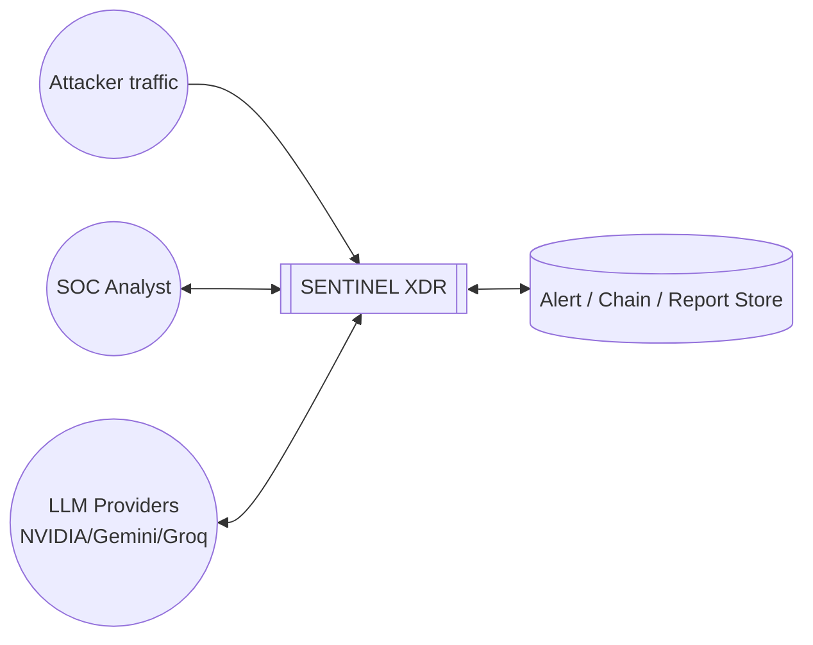
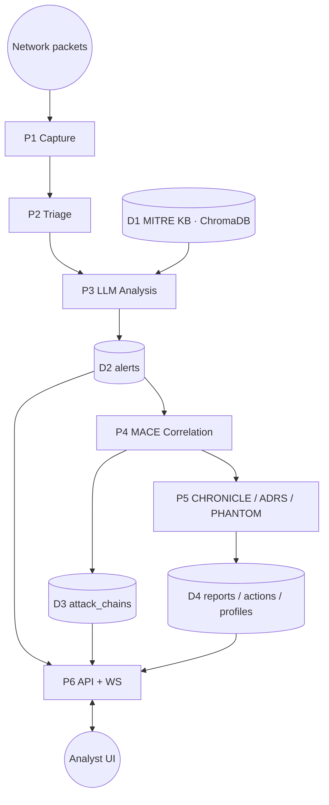

# System Design Document — SENTINEL XDR (AI-IDS)

**Course:** Information Security · **Instructor:** Muhammad Zunnurain Hussain
**Institution:** University of Management and Technology (UMT)
**Team:** Adnan Faisal (F2023376084, D1), Muhammad Ahmad Raza (F2022266612, D1), Obaiz Mehmood (F2023376067, A1), Haider Ali (F2023376077, A1)
**Repository:** github.com/Obaiz1/sentinel-xdr · **Live:** sentinel-xdr.vercel.app · **API:** obaiz-sentinel-xdr-backend.hf.space

> Diagrams use Mermaid (renders on GitHub / VS Code / Overleaf-mermaid; or export to PNG for the IEEE PDF).

---

## 1. Design Goals & Scope

| Goal | Design decision |
|---|---|
| Detect both known and novel attacks | Heuristic triage (fast, deterministic) + LLM semantic analysis (generalising) |
| Explainable alerts | LLM returns natural-language reason + MITRE technique + recommended action |
| Grounded AI (no hallucination) | RAG over a MITRE ATT&CK corpus (ChromaDB) injected into the prompt |
| Multi-stage awareness | MACE correlation engine builds kill-chain "attack chains" |
| Resilience | 3-tier LLM provider fallback (NVIDIA → Gemini → Groq) with back-off |
| Safety | Autonomous response is **dry-run only**; cloud has no live capture (Demo Mode) |
| Usability | Next.js SOC "command-center" UI with live charts and a conversational copilot (ARIA) |

**Scope:** authorised, defensive monitoring of a single host/segment. Out of scope: offensive capture, payload exfiltration, destructive automated response.

---

## 2. High-Level Architecture



**Deployment:** Frontend → **Vercel**; Backend (FastAPI) → **Hugging Face Docker Space** (16 GB). Live packet capture runs only on a **local Windows host with Npcap + Administrator**; in the cloud, **Demo Mode** synthesises telemetry.

---

## 3. The Five-Stage Detection Pipeline

```mermaid
flowchart TD
  A[1. Capture\nScapy AsyncSniffer\nBPF filter] --> B[2. Triage\n10+ heuristic rules\nO(1) sliding window]
  B -->|suspicious only| C[3. AI Analysis\nRAG context + LLM\nMITRE + confidence]
  C --> D[4. Persist\nSQLite alert record]
  D --> E[5. Correlate & Serve\nMACE chains → FastAPI/WS → UI]
  B -->|benign| X[discard / count only]
```

1. **Capture** — `PacketSniffer` extracts metadata (src/dst IP, ports, protocol, TCP flags, size, bounded payload-hex) only; full payloads are **not** stored.
2. **Triage** — deterministic heuristics flag SYN scan, port sweep, NULL/XMAS/FIN scan, ICMP flood, DNS tunnelling, large payload, suspicious ports (e.g., 4444), and high-frequency sources using a thread-safe **sliding-window tracker** (amortised O(1)/packet).
3. **AI Analysis** — only flagged packets reach the **LLM Analyzer**; the prompt is enriched with **RAG-retrieved MITRE techniques**; the model returns structured JSON (threat level, attack vector, MITRE ID, confidence, explanation, recommended action), validated and normalised.
4. **Persist** — the alert is written to SQLite via `aiosqlite`.
5. **Correlate & Serve** — **MACE** groups alerts into attack chains; the **FastAPI** layer (REST + `/ws/alerts`) serves the Next.js dashboard.

---

## 4. Data-Flow Diagram

**Level-0 (context):**


**Level-1 (processes & stores):**


---

## 5. Threat Model (STRIDE)

The IDS is itself an asset; we model threats against it.

| STRIDE category | Threat | Mitigation in design |
|---|---|---|
| **Spoofing** | Forged source IPs in captured traffic mislead triage | Heuristics treat src IP as untrusted; correlation uses behaviour, not identity |
| **Tampering** | Manipulated packets to evade rules | Multiple orthogonal heuristics + LLM semantic check reduce single-rule evasion |
| **Repudiation** | No audit trail of detections | All alerts/sessions/chains persisted with timestamps in SQLite |
| **Information Disclosure** | Sensitive payloads stored | **Only metadata** captured; payload hex bounded; no credentials stored |
| **Denial of Service** | Packet flood overwhelms pipeline | Bounded async queues (packet/LLM) with back-pressure; triage is O(1)/packet |
| **Elevation of Privilege** | Capture needs admin; abuse risk | Capture gated behind explicit `/toggle-sniffing`; cloud runs no capture |
| **(LLM-specific) Prompt Injection** | Malicious strings in traffic poison the LLM | **AEGIS** engine scans for injection patterns; system prompt isolates context |
| **(LLM-specific) Provider outage / cost abuse** | Single LLM fails or quota drained | 3-tier fallback + back-off; keys are backend-only secrets |

**MITRE ATT&CK coverage (detection):** Reconnaissance (T1595), Initial Access (T1190), Execution (T1059), Lateral Movement (T1021), C2 (T1071), Exfiltration (T1041/T1048), Impact/DoS (T1499) — surfaced per-alert and per-chain.

---

## 6. Component & Module Breakdown

| Module (`modules/…` + core) | Responsibility |
|---|---|
| `sniffer` (PacketSniffer) | Scapy `AsyncSniffer`, BPF filter, metadata extraction |
| `triage` (TriageEngine) | Heuristic rules + sliding-window tracker + priority scoring |
| `llm_client` / `nvidia_llm` | Multi-provider LLM calls, JSON parsing, retry/back-off |
| `rag_engine` | ChromaDB store of MITRE techniques; context retrieval |
| `correlation` (MACE) | Kill-chain template matching → attack chains |
| `adrs` *(via engines)* | Dry-run autonomous response policy engine |
| `phantom` | Long-term attacker actor profiling |
| `chronicle` | LLM executive incident-report generation |
| `aegis` | Prompt-injection / AI-evasion scanner |
| `aria` (ARIAAgent) | Conversational SOC copilot (streaming, RAG-grounded) |
| `database` (DatabaseManager) | Async SQLite CRUD |
| `main` (FastAPI) | REST + WebSocket API, lifecycle orchestration |
| `sentinel-ui` (Next.js) | SOC command-center UI |

---

## 7. Data Model (SQLite schema — implemented)

| Table | Key fields |
|---|---|
| `alerts` | id, timestamp, src_ip, dst_ip, src_port, dst_port, protocol, tcp_flags, triage_flags, threat_level, confidence, attack_vector, mitre_technique, explanation, recommended_action, status |
| `capture_sessions` | id, started_at, stopped_at, interface, total/flagged/analyzed packets |
| `attack_chains` | chain_id, actor_id, events_json, kill_chain_phases, mitre_techniques, chain_score, attacker_intent, ai_confidence, status, first/last_seen |
| `response_actions` | action_id, chain_id, action_type, target_ip, policy_name, simulated, analyst_approved, outcome |
| `attacker_profiles` | actor_id, first/last_seen, total_chains, known_tactics, risk_score, confidence_level |
| `incident_reports` | report_id, chain_id, actor_id, executive_summary, technical_details, generated_at |

---

## 8. API Design (representative endpoints)

| Method | Path | Purpose |
|---|---|---|
| GET | `/status` | system/sniffer/LLM/RAG/DB/queue health |
| GET | `/interfaces` | capture interfaces |
| POST | `/toggle-sniffing` | start/stop live capture |
| POST | `/api/sniffer/demo/{start,stop}` | Demo Mode telemetry |
| GET | `/alerts`, `/alerts/recent`, `/alerts/{id}` | alert retrieval |
| GET | `/statistics` | threat distribution, protocol breakdown, timeline, top sources/vectors |
| GET | `/chains` | active MACE attack chains |
| POST | `/api/chronicle/{chain_id}` | generate incident narrative |
| POST | `/api/engines/{engine}/run` | run mace/aria/adrs/phantom/aegis/chronicle |
| POST | `/api/aria/chat` | streamed ARIA conversation |
| WS | `/ws/alerts` | real-time alert stream |

---

## 9. Technology Stack

- **Capture/Analysis:** Python 3.12, Scapy, asyncio
- **AI:** NVIDIA NIM (Llama-3.3-70B) primary, Google Gemini + Groq fallback; ChromaDB (RAG)
- **Backend:** FastAPI, Uvicorn, aiosqlite (SQLite)
- **Frontend:** Next.js 16 (React 19, TypeScript), Recharts, three.js globe, framer-motion, jsPDF
- **Deployment:** Vercel (frontend), Hugging Face Docker Space (backend), GitHub (VCS)

---

## 10. Design Limitations (carried into the report)

1. Live capture requires Npcap + Administrator on a local host (no raw capture in cloud).
2. Encrypted/TLS-wrapped C2 cannot be inspected at payload level (metadata-only).
3. LLM latency and provider rate-limits bound real-time analysis throughput.
4. Autonomous response is intentionally dry-run (no real firewall changes) for safety.
